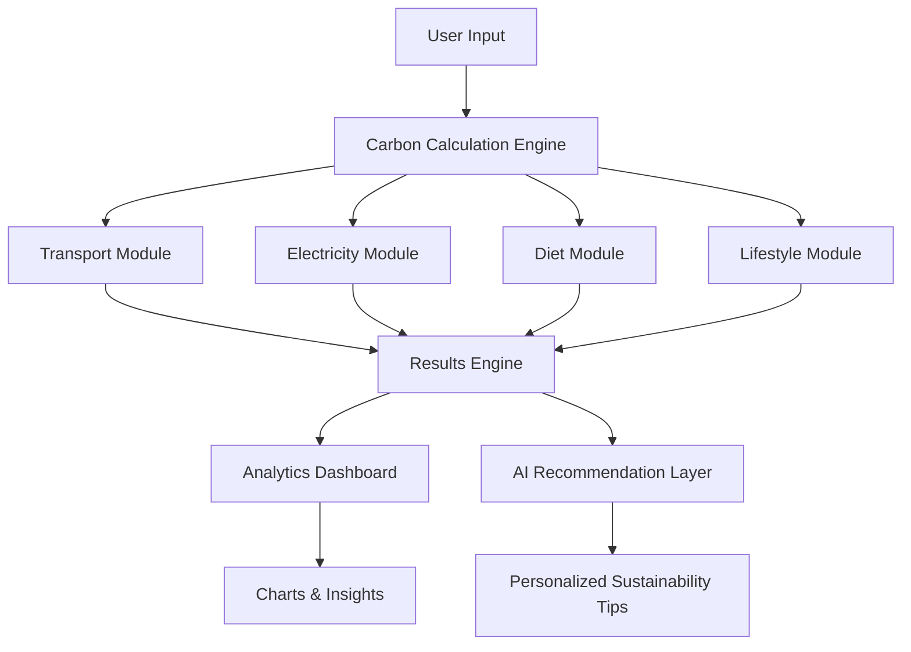

# 🌱 GreenIQ

### India's Hyperlocal Carbon Intelligence Platform

<div align="center">

**Measure • Understand • Reduce • Sustain**

A modern carbon footprint intelligence platform built specifically for Indian lifestyles, helping individuals calculate, track, and reduce their environmental impact through hyperlocal emission modeling, AI-powered recommendations, sustainability analytics, and long-term behavior tracking.

🌍 **Live Demo:** https://greeniq-lyart.vercel.app/


</div>

---

# 🚀 Why GreenIQ?

Most carbon footprint calculators are designed around Western lifestyles and assumptions.

They often ignore realities that millions of Indians experience daily:

* 🛺 Auto-rickshaws
* 🏍 Two-wheelers
* 🚇 Metro systems
* 🔥 LPG & PNG cooking fuels
* ⚡ State-specific electricity grids
* 🍛 Indian dietary patterns
* 🚆 Indian Railways
* 🏠 Indian household energy consumption

As a result, users receive estimates that are often inaccurate and difficult to act upon.

**GreenIQ solves this problem through hyperlocal carbon intelligence designed specifically for India.**

---

# ✨ Key Highlights

| Metric                        | Value |
| ----------------------------- | ----- |
| 🇮🇳 States & UTs Supported   | 37    |
| 🚗 Transport Modes            | 9     |
| 🍽 Diet Profiles              | 5     |
| 📊 Interactive Visualizations | 10+   |
| 🏆 Achievement Badges         | 6     |
| 🧪 Unit Tests                 | 30+   |
| ⚡ Backend Required            | No    |
| 🤖 AI Assistance              | Yes   |
| 📱 Responsive Design          | 100%  |

---

# 📸 Screenshots

## Dashboard Overview


*Interactive carbon footprint dashboard showing emission breakdowns, sustainability score, benchmarks, and environmental impact equivalents.*

---

## Carbon Calculator


*Multi-step calculator with India-specific transport, electricity, diet, and lifestyle inputs.*

---

## AI-Powered Recommendations


*Personalized sustainability recommendations ranked by impact, effort, and estimated CO₂ savings.*

---

## Historical Tracking


*Track carbon footprint trends over time with historical analytics and progress monitoring.*

---

## What-If Scenario Simulator


*Experiment with lifestyle changes and instantly visualize potential carbon reductions.*

# 🎯 Core Features

## 📊 Carbon Footprint Calculator

Calculate annual carbon emissions across multiple categories:

### 🚗 Transportation

* Car
* Bike
* Scooter
* Auto-rickshaw
* Shared cab
* Metro
* Bus
* Railways
* Flights

### ⚡ Electricity

* Monthly electricity consumption
* Bill-to-kWh conversion
* State-specific emission factors
* Regional grid analysis

### 🍽 Diet

* Vegan
* Vegetarian
* Eggetarian
* Chicken-based
* Mixed diet

### 🔥 Household Energy

* LPG
* PNG
* Induction cooking
* Air-conditioner usage

### ✈️ Travel

* Domestic flights
* Rail journeys
* Long-distance travel patterns

---

## 📈 Interactive Sustainability Dashboard

GreenIQ transforms raw emissions data into meaningful insights.

### Included Visualizations

* Doughnut emission breakdown
* Historical trend charts
* Category comparisons
* National benchmark comparisons
* Global benchmark comparisons
* Carbon intensity gauges

### Key Insights

Users instantly understand:

* Their largest emission sources
* Reduction opportunities
* Sustainability progress
* Long-term behavioral trends

---

## 🤖 AI-Powered Sustainability Advisor

GreenIQ generates personalized recommendations based on a user's footprint profile.

### Recommendation Engine

* Category-specific recommendations
* Ranked by impact
* Estimated carbon savings
* Effort assessment
* India-specific suggestions

Examples:

* Switching to metro commuting
* Adopting induction cooking
* PM-SURYA Ghar solar adoption
* Railway alternatives to flights
* Carpooling strategies

### Reliable Fallback System

Even without an API key:

✅ Personalized recommendations remain available

✅ User experience remains uninterrupted

✅ Suggestions remain actionable and context-aware

---

## 🧪 What-If Scenario Simulator

Users can preview the impact of sustainability decisions before implementing them.

Examples:

* Using metro instead of a private vehicle
* Reducing AC usage
* Switching diet patterns
* Adopting induction cooking
* Increasing public transport usage

Results update instantly.

---

## 🏆 Gamification & Engagement

To encourage long-term behavior change:

### Included Features

* Achievement badges
* Sustainability milestones
* Monthly streak tracking
* Progress indicators
* Behavioral rewards

### Example Badges

🌱 Eco Warrior

🚆 Rail Champion

⚡ Coal-Free Hero

✈️ Frequent Flyer

🏆 Sustainability Master

---

# 🌍 Hyperlocal Intelligence

One of GreenIQ's biggest differentiators.

### State-Wise Grid Emission Factors

Electricity emissions vary significantly across India.

| State     | Grid Factor    |
| --------- | -------------- |
| Karnataka | 0.50 kgCO₂/kWh |
| Jharkhand | 0.97 kgCO₂/kWh |

This creates significantly more realistic carbon calculations.

---

# 📚 Historical Tracking

Unlike one-time calculators, GreenIQ promotes continuous improvement.

### Tracking Features

* Automatic history saving
* Trend visualization
* Entry comparisons
* Percentage changes
* Monthly streaks

Persistence is handled using localStorage, requiring no backend.

---

# 🎨 User Experience

### Modern Design

* Fully responsive
* Mobile-first
* Dark mode
* Accessible interface
* Animated dashboards
* Smooth transitions

### Accessibility

* Semantic HTML
* WCAG-compliant contrast
* Keyboard navigation
* Screen-reader support
* Reduced-motion support
* ARIA labels throughout

---

# 🏗 Architecture



---

# ⚙️ Tech Stack

| Layer       | Technology        |
| ----------- | ----------------- |
| Frontend    | React 19          |
| Build Tool  | Vite              |
| Charts      | Chart.js          |
| Testing     | Vitest            |
| AI          | Google Gemini API |
| Persistence | localStorage      |
| Security    | DOMPurify         |
| Styling     | Vanilla CSS       |

---

# 📂 Project Structure

```text
greeniq/
│
├── src/
│   ├── data/
│   ├── engine/
│   ├── hooks/
│   ├── utils/
│   ├── styles/
│   └── tests/
│
├── public/
├── package.json
└── README.md
```

---

# 🔬 Calculation Methodology

GreenIQ follows a deterministic calculation model.

### Important Principle

> AI never performs carbon calculations.

All emissions are computed using documented emission factors from:

* Central Electricity Authority (CEA)
* TERI
* IEA
* IPCC
* DEFRA
* IISc Bangalore
* Research-backed Indian dietary studies

### Benefits

* Reproducibility
* Transparency
* Scientific consistency
* Auditability

The AI layer is used only for recommendation generation.

---

# 🏆 Competitive Advantage

| Feature                       | GreenIQ | Typical Calculator |
| ----------------------------- | ------- | ------------------ |
| Indian Grid Factors           | ✅       | ❌                  |
| Auto-Rickshaw Support         | ✅       | ❌                  |
| Two-Wheeler Modeling          | ✅       | ❌                  |
| Indian Diet Profiles          | ✅       | ❌                  |
| Historical Tracking           | ✅       | ❌                  |
| AI Recommendations            | ✅       | ⚠️                 |
| What-If Simulator             | ✅       | ❌                  |
| Achievement System            | ✅       | ❌                  |
| State-Level Personalization   | ✅       | ❌                  |
| India-Specific Reduction Tips | ✅       | ❌                  |

---

# 🚀 Getting Started

## Prerequisites

* Node.js 18+
* npm

## Installation

```bash
git clone <repository-url>

cd greeniq

npm install
```

### Configure Environment Variables

```bash
cp .env.example .env
```

Add:

```env
VITE_GEMINI_API_KEY=your_api_key_here
```

### Start Development Server

```bash
npm run dev
```

Runs on:

```text
http://localhost:5173
```

---

# 🧪 Testing

Run all tests:

```bash
npm test
```

Coverage:

```bash
npm run test:coverage
```

Watch mode:

```bash
npm run test:watch
```

---

# 🌟 Beyond the Requirements

GreenIQ includes several features that go beyond the original challenge:

* Interactive India state map
* What-if carbon simulator
* AI-powered sustainability coach
* Shareable PNG score cards
* Achievement badge system
* Carbon equivalence visualizations
* Dynamic severity themes
* Animated sustainability gauges
* Historical trend analytics
* Personalized reduction planning

---

# 🛣 Roadmap

* Carbon reduction goals
* Community sustainability challenges
* Renewable energy recommendations
* Carbon offset integration
* Multi-language support
* Regional environmental insights
* Smart sustainability coaching

---

# 🤝 Contributing

Contributions are welcome.

```bash
git checkout -b feature/amazing-feature

git commit -m "Add amazing feature"

git push origin feature/amazing-feature
```

Then open a Pull Request.

---

# 📜 License

MIT License

---

# 🌱 Final Thought

GreenIQ is more than a carbon footprint calculator.

It is a sustainability intelligence platform designed to help individuals transform awareness into measurable action through hyperlocal data, scientific transparency, AI-powered guidance, and long-term behavioral change.

**Measure. Understand. Improve. Sustain.**

---

# ⭐ Support the Project

If you found GreenIQ useful, insightful, or inspiring, please consider giving it a star on GitHub.

⭐ Starring the repository helps increase visibility and motivates continued development.

```bash
git clone <repository-url>
```

**If you like GreenIQ, don't forget to leave a ⭐ on the repository!**

---

# 👨‍💻 Author

## Prabhav Agrawal

B.Tech Computer Science & Applied Mathematics (CSAM) student at IIIT Delhi, passionate about building impactful technology that combines software engineering, data-driven decision making, and real-world problem solving.

### Interests

- Full-Stack Development
- Artificial Intelligence & Machine Learning
- Data Science
- Sustainability Technology
- Human-Centered Product Design
- Open Source Development

### Connect With Me

- GitHub: https://github.com/<your-github-username>
- LinkedIn: https://linkedin.com/in/<your-linkedin-username>
- Portfolio: https://<your-portfolio-link>

Feel free to reach out for collaborations, open-source contributions, hackathons, or interesting project discussions.

---

# 🏅 About This Project

GreenIQ was developed to address a critical gap in sustainability tools available to Indian users.

While most carbon footprint calculators are designed around Western assumptions, GreenIQ provides a hyperlocal and India-first approach to carbon intelligence by incorporating:

- State-wise electricity emission factors
- Indian transportation systems
- Local dietary patterns
- India-specific sustainability recommendations
- Personalized reduction strategies

The goal is simple:

> Make sustainability understandable, measurable, and actionable for everyone.

---
